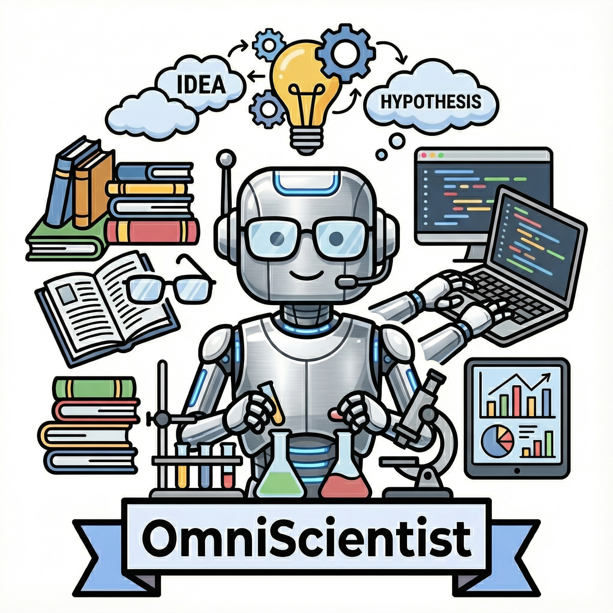

<div align="center">

<table style="border: none; margin: 0 auto; padding: 0; border-collapse: collapse;">
  <tr>
    <td align="center" style="vertical-align: middle; padding: 10px 20px 10px 10px; border: none;">
      
    </td>
    <td align="left" style="vertical-align: middle; padding: 10px 0; border: none;">
<pre style="font-family: 'Courier New', monospace; font-size: 12px; color: #0EA5E9; margin: 0; padding: 0; text-shadow: 0 0 10px #0EA5E9, 0 0 20px rgba(14,165,233,0.5); line-height: 1.2; transform: skew(-1deg, 0deg); display: block; text-align: left; white-space: pre;">
  █████╗ ██╗    ███████╗ ██████╗██╗███████╗███╗   ███╗████████╗██╗███████╗████████╗
 ██╔══██╗██║    ██╔════╝██╔════╝██║██╔════╝████╗  ████║╚══██╔══╝██║██╔════╝╚══██╔══╝
 ███████║██║    ███████╗██║     ██║█████╗  ██╔██╗ ██╔██║   ██║   ██║███████╗   ██║
 ██╔══██║██║    ╚════██║██║     ██║██╔══╝  ██║╚██╗██║██║   ██║   ██║╚════██║   ██║
 ██║  ██║██║    ███████║╚██████╗██║███████╗██║ ╚████║██║   ██║   ██║███████║   ██║
 ╚═╝  ╚═╝╚═╝    ╚══════╝ ╚═════╝╚═╝╚══════╝╚═╝  ╚═══╝╚═╝   ╚═╝   ╚═╝╚══════╝   ╚═╝
 ███████╗ ██████╗ ██████╗ ███████╗██╗   ██╗███████╗████████╗███████╗███╗   ███╗
 ██╔════╝██╔════╝██╔═══██╗██╔════╝╚██╗ ██╔╝██╔════╝╚══██╔══╝██╔════╝████╗ ████║
 █████╗  ██║     ██║   ██║███████╗ ╚████╔╝ ███████╗   ██║   █████╗  ██╔██╗██╔██║
 ██╔══╝  ██║     ██║   ██║╚════██║  ╚██╔╝  ╚════██║   ██║   ██╔══╝  ██║╚██╔╝██║
 ███████╗╚██████╗╚██████╔╝███████║   ██║   ███████║   ██║   ███████╗██║ ╚═╝ ██║
 ╚══════╝ ╚═════╝ ╚═════╝ ╚══════╝   ╚═╝   ╚══════╝   ╚═╝   ╚══════╝╚═╝     ╚═╝
</pre>
    </td>
  </tr>
</table>

<!-- # 🤖 AI Scientist Ecosystem -->

<div align="center">

<a href="https://github.com/FIBLAB/AI-Scientist-Ecosystem">
  
</a>

<h3 style="margin-top: -10px; font-family: sans-serif; font-weight: bold; color: #0EA5E9;">
  Towards Fully Automated Open-Ended Scientific Discovery
</h3>

<p align="center" style="margin-top: 15px;">
  
  
  
  
</p>

</div>


</div>

---

## 📖 Introduction

Welcome to the **AI Scientist Ecosystem** project. This project is initiated by **FIB LAB, Tsinghua University**, dedicated to exploring and building the next generation of Artificial Intelligence Scientist systems.

Our vision is to build a comprehensive ecosystem named **OmniScientist**, enabling AI to possess full-process scientific research capabilities like human scientists, ranging from idea generation and literature review to experiment design and paper writing. This repository collects a series of our core papers and research results surrounding this vision.

---

## 📝 Paper Collection

We currently include seven core papers, covering surveys, benchmarks, core algorithms (idea generation, experiment design), and macro-ecosystem construction.

### 🌟 Core Ecosystem

| Paper Title | Description | Link |
| :--- | :--- | :---: |
| **OmniScientist: Towards an AI Scientist Ecosystem via Human Research Infrastructure Encoding** | Proposes the grand blueprint of the AI Scientist ecosystem, achieving fully automated scientific research by encoding human research infrastructure. | 🚧 Coming Soon |
| **MirrorMind: Empowering the OmniScientist with Human Expertise and Collective Knowledge** | Explores how to empower AI scientists with human expert tacit knowledge and collective intelligence to enhance their decision-making capabilities. | 🚧 Coming Soon |

### 🧠 Core Capabilities & Agents

| Paper Title | Description | Link |
| :--- | :--- | :---: |
| **Deep Ideation: Designing LLM Agents to Generate Novel Research Ideas on Scientific Concept Network** | **[Idea Generation]** Designed LLM agents based on scientific concept networks to generate novel and valuable research ideas. | [](https://arxiv.org/abs/2511.02238) |
| **AgentExpt: Automating AI Experiment Design with LLM-based Resource Retrieval Agent** | **[Experiment Design]** Proposed an LLM agent based on resource retrieval, achieving automation of AI experiment design. | [](https://arxiv.org/abs/2511.04921) |

### 📊 Survey & Benchmarks

| Paper Title | Description | Link |
| :--- | :--- | :---: |
| **A Comprehensive Survey of AI Scientists** | Comprehensively reviews the development history, current status, and future trends of the AI Scientist field. | 🚧 Coming Soon |
| **Scinetbench: A Relation-Aware Benchmark for Scientific Literature Retrieval Agents** | **[Benchmark]** Proposed a relation-aware benchmark specifically for evaluating the performance of scientific literature retrieval agents. | 🚧 Coming Soon |
| **Can AI Scientists Identify Meaningful Research Questions?** | Deeply explores whether AI possesses the ability to identify "meaningful" scientific questions, which is a critical step in scientific discovery. | 🚧 Coming Soon |

---

## 🚀 News & Updates

*   **[2025.11]** 🎉 **AgentExpt** released on arXiv, showcasing the latest results in automated experiment design.
*   **[2025.11]** 🎉 **Deep Ideation** released on arXiv, exploring the potential of AI in scientific idea generation.
*   **[2025.10]** Project officially launched, establishing the five core research directions of the OmniScientist ecosystem.

---

## 🔬 Highlights

### 1. Deep Ideation: Automated Generation of Scientific Ideas
> *Designing LLM Agents to Generate Novel Research Ideas on Scientific Concept Network*

In scientific research, coming up with good ideas is often the most challenging step. **Deep Ideation** generates innovative research hypotheses by building a scientific concept network and using Large Language Models (LLMs) to establish new connections between concepts.

### 2. AgentExpt: Intelligent Experiment Design
> *Automating AI Experiment Design with LLM-based Resource Retrieval Agent*

**AgentExpt** addresses the challenge of translating abstract research ideas into concrete experimental steps. By introducing a resource retrieval agent, the system can automatically find available codebases, datasets, and tools based on research goals, and design executable experimental plans.

---

## 🤝 Citation

If you find our work helpful to your research, please consider citing our published papers:

```bibtex
@article{deep_ideation_2025,
  title={Deep Ideation: Designing LLM Agents to Generate Novel Research Ideas on Scientific Concept Network},
  year={2025},
  journal={arXiv preprint arXiv:2511.02238}
}

@article{agentexpt_2025,
  title={AgentExpt: Automating AI Experiment Design with LLM-based Resource Retrieval Agent},
  year={2025},
  journal={arXiv preprint arXiv:2511.04921}
}
```

---

## 📧 Contact

If you have any questions or collaboration intentions, please feel free to contact us via GitHub Issues or email.

<div align="center">
Copyright (c) 2025 FIB LAB, Tsinghua University
</div>
