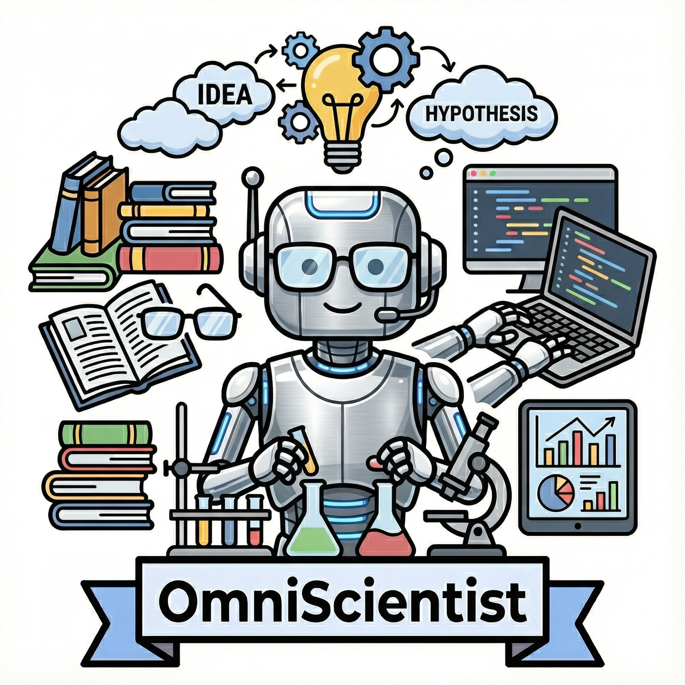

<div align="center">

<div align="center">
<pre style="font-family: 'Courier New', monospace; font-size: 14px; color: #0EA5E9; margin: 0; padding: 20px; text-shadow: 0 0 10px #0EA5E9, 0 0 20px rgba(14,165,233,0.5); line-height: 1.2; transform: skew(-1deg, 0deg); display: block; text-align: center; white-space: pre;">
  █████╗ ██╗    ███████╗ ██████╗██╗███████╗███╗   ███╗████████╗██╗███████╗████████╗
 ██╔══██╗██║    ██╔════╝██╔════╝██║██╔════╝████╗  ████║╚══██╔══╝██║██╔════╝╚══██╔══╝
 ███████║██║    ███████╗██║     ██║█████╗  ██╔██╗ ██╔██║   ██║   ██║███████╗   ██║
 ██╔══██║██║    ╚════██║██║     ██║██╔══╝  ██║╚██╗██║██║   ██║   ██║╚════██║   ██║
 ██║  ██║██║    ███████║╚██████╗██║███████╗██║ ╚████║██║   ██║   ██║███████║   ██║
 ╚═╝  ╚═╝╚═╝    ╚══════╝ ╚═════╝╚═╝╚══════╝╚═╝  ╚═══╝╚═╝   ╚═╝   ╚═╝╚══════╝   ╚═╝
 ███████╗ ██████╗ ██████╗ ███████╗██╗   ██╗███████╗████████╗███████╗███╗   ███╗
 ██╔════╝██╔════╝██╔═══██╗██╔════╝╚██╗ ██╔╝██╔════╝╚══██╔══╝██╔════╝████╗ ████║
 █████╗  ██║     ██║   ██║███████╗ ╚████╔╝ ███████╗   ██║   █████╗  ██╔██╗██╔██║
 ██╔══╝  ██║     ██║   ██║╚════██║  ╚██╔╝  ╚════██║   ██║   ██╔══╝  ██║╚██╔╝██║
 ███████╗╚██████╗╚██████╔╝███████║   ██║   ███████║   ██║   ███████╗██║ ╚═╝ ██║
 ╚══════╝ ╚═════╝ ╚═════╝ ╚══════╝   ╚═╝   ╚══════╝   ╚═╝   ╚══════╝╚═╝     ╚═╝
</pre>
</div>

<!-- # 🤖 AI Scientist Ecosystem -->

<div align="center">

<a href="https://github.com/FIBLAB/AI-Scientist-Ecosystem">
  
</a>

<h3 style="margin-top: -10px; font-family: sans-serif; font-weight: bold; color: #0EA5E9;">
  Towards Fully Automated Open-Ended Scientific Discovery
</h3>

<div align="center">
  
</div>
<p align="center" style="margin-top: 15px;">
  
  
  
  
</p>

</div>

</div>

---

## 📖 Introduction

Welcome to the **AI Scientist Ecosystem** project. This project is initiated by **FIB LAB, Tsinghua University** and **Zhongguancun Academy**, dedicated to exploring and building the next generation of Artificial Intelligence Scientist systems.

Our vision is to build a comprehensive ecosystem named **OmniScientist**, enabling AI to possess full-process scientific research capabilities like human scientists, ranging from idea generation and literature review to experiment design and paper writing. This repository collects a series of our core papers and research results surrounding this vision.

---

https://github.com/user-attachments/assets/83ce229b-03d1-4eec-a84d-4d0203dd18a3

## 📝 Paper Collection

We currently include seven core papers, covering surveys, benchmarks, core algorithms (idea generation, experiment design), and macro-ecosystem construction.

### 🌟 Core Ecosystem

| Paper Title | Description | Link |
| :--- | :--- | :---: |
| **OmniScientist: Toward a Co-evolving Ecosystem of Human and AI Scientists** | Proposes the grand blueprint of the AI Scientist ecosystem, achieving fully automated scientific research by encoding human research infrastructure. | [](https://arxiv.org/abs/2511.16931) |
| **MirrorMind: Empowering OmniScientist with the Expert Perspectives and Collective Knowledge of Human Scientists** | Explores how to empower AI scientists with human expert tacit knowledge and collective intelligence to enhance their decision-making capabilities. | [](https://arxiv.org/abs/2511.16997) |
| **HybridQuestion: Human–AI Collaboration for Identifying High-Impact Research Questions** | Deeply explores whether AI possesses the ability to identify "meaningful" scientific questions, which is a critical step in scientific discovery. | [Paper](./papers/HybridQuestion.pdf) |

### 🧠 Core Capabilities & Agents

| Paper Title | Description | Link |
| :--- | :--- | :---: |
| **Deep Ideation: Designing LLM Agents to Generate Novel Research Ideas on Scientific Concept Network** | **[Idea Generation]** Designed LLM agents based on scientific concept networks to generate novel and valuable research ideas. | [](https://arxiv.org/abs/2511.02238) |
| **AgentExpt: Automating AI Experiment Design with LLM-based Resource Retrieval Agent** | **[Experiment Design]** Proposed an LLM agent based on resource retrieval, achieving automation of AI experiment design. | [](https://arxiv.org/abs/2511.04921) |

### 📊 Survey & Benchmarks

| Paper Title | Description | Link |
| :--- | :--- | :---: |
| **A Comprehensive Survey of AI Scientists** | Comprehensively reviews the development history, current status, and future trends of the AI Scientist field. | 🚧 Coming Soon |
| **Scinetbench: A Relation-Aware Benchmark for Scientific Literature Retrieval Agents** | **[Benchmark]** Proposed a relation-aware benchmark specifically for evaluating the performance of scientific literature retrieval agents. | 🚧 Coming Soon |

---

## 🚀 News & Updates

*   **[2025.11]** 🎉 **OmniScientist** released on arXiv, proposing the blueprint for a co-evolving ecosystem toward fully automated scientific research. 
*   **[2025.11]** 🎉 **MirrorMind** released on arXiv, empowering AI scientists with expert perspectives to enhance decision-making capabilities.
*   **[2025.11]** 🎉 **AgentExpt** released on arXiv, showcasing the latest results in automated experiment design.
*   **[2025.11]** 🎉 **Deep Ideation** released on arXiv, exploring the potential of AI in scientific idea generation.
*   **[2025.10]** Project officially launched, establishing the five core research directions of the OmniScientist ecosystem.

---

## 🔬 Highlights

### 1. OmniScientist: The Co-evolving Research Ecosystem

> *Toward a Co-evolving Ecosystem of Human and AI Scientists*

**OmniScientist** proposes a grand blueprint for the future of scientific discovery, aiming to achieve fully automated research. By encoding the complex infrastructure of human research into machine-understandable formats, it establishes a co-evolving ecosystem where human and AI scientists collaborate, significantly accelerating the research lifecycle.

### 2. MirrorMind: Infusing Human Expert Intuition

> *Empowering OmniScientist with the Expert Perspectives and Collective Knowledge of Human Scientists*

**MirrorMind** focuses on enhancing the cognitive depth of AI researchers. It empowers AI scientists by integrating the "tacit knowledge" and collective intelligence of human experts. This approach enables the AI to move beyond simple data processing, improving its decision-making capabilities and allowing for more nuanced scientific judgments.

### 3. Deep Ideation: Automated Generation of Scientific Ideas

> *Designing LLM Agents to Generate Novel Research Ideas on Scientific Concept Network*

In scientific research, coming up with good ideas is often the most challenging step. **Deep Ideation** generates innovative research hypotheses by building a scientific concept network and using Large Language Models (LLMs) to establish new connections between concepts.

### 4. AgentExpt: Intelligent Experiment Design
> *Automating AI Experiment Design with LLM-based Resource Retrieval Agent*

**AgentExpt** addresses the challenge of translating abstract research ideas into concrete experimental steps. By introducing a resource retrieval agent, the system can automatically find available codebases, datasets, and tools based on research goals, and design executable experimental plans.

---

## 🤝 Citation

If you find our work helpful to your research, please consider citing our published papers:

```bibtex
@article{deep_ideation_2025,
  title={Deep Ideation: Designing LLM Agents to Generate Novel Research Ideas on Scientific Concept Network},
  year={2025},
  journal={arXiv preprint arXiv:2511.02238}
}

@article{agentexpt_2025,
  title={AgentExpt: Automating AI Experiment Design with LLM-based Resource Retrieval Agent},
  year={2025},
  journal={arXiv preprint arXiv:2511.04921}
}
```

---

## 📧 Contact

If you have any questions or collaboration intentions, please feel free to contact us via GitHub Issues or email.

<div align="center">
Copyright (c) 2025 FIB LAB, Tsinghua University
</div>
